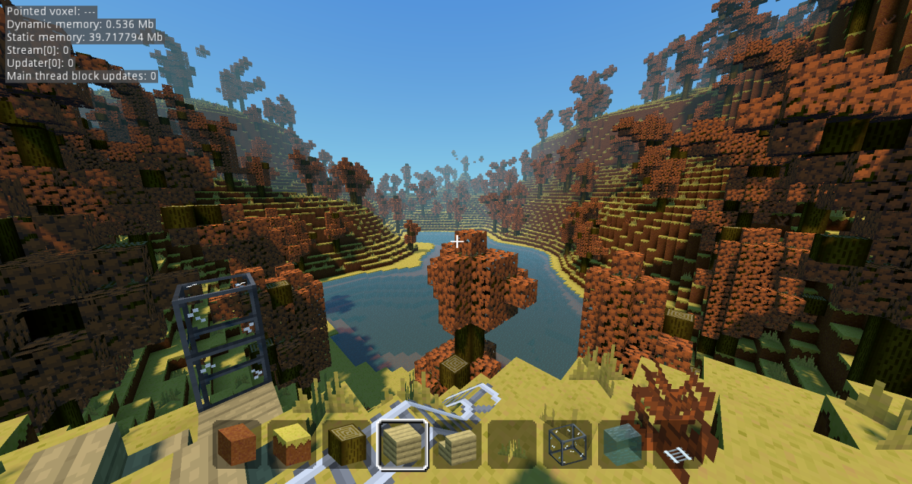

Voxel game demos (Godot Engine)
===============================

This project contains several scenes to test and demo the voxel module I'm developing for Godot Engine.

Dependencies
---------------

This project uses a C++ module:
- [Voxel](https://github.com/Zylann/godot_voxel)

For the old (unmaintained) pure-GDScript version, checkout the branch `full_gdscript`.

Runnable scenes
-----------------

- `blocky_game/blocky_game.tscn`: sort of Minecraft clone with random features.
- `blocky_terrain/main.tscn`: simple test for blocky terrain
- `smooth_terrain/main.tscn`: simple test for Transvoxel smooth terrain
