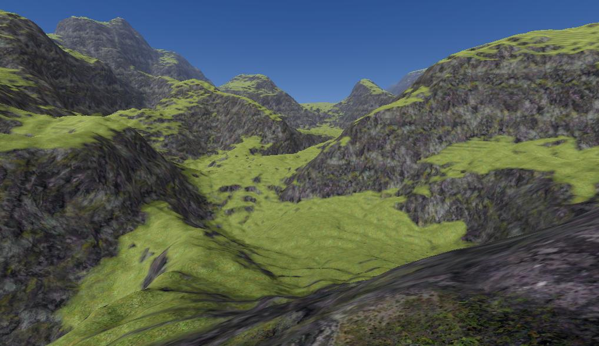
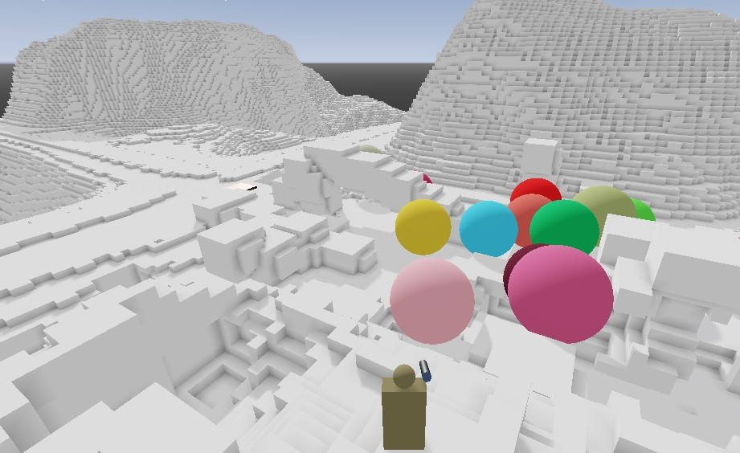
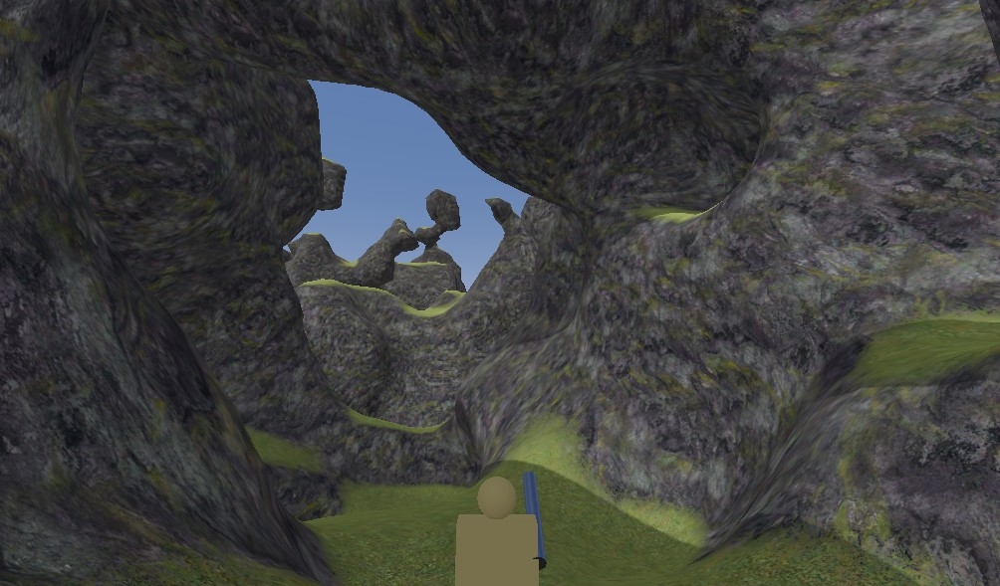
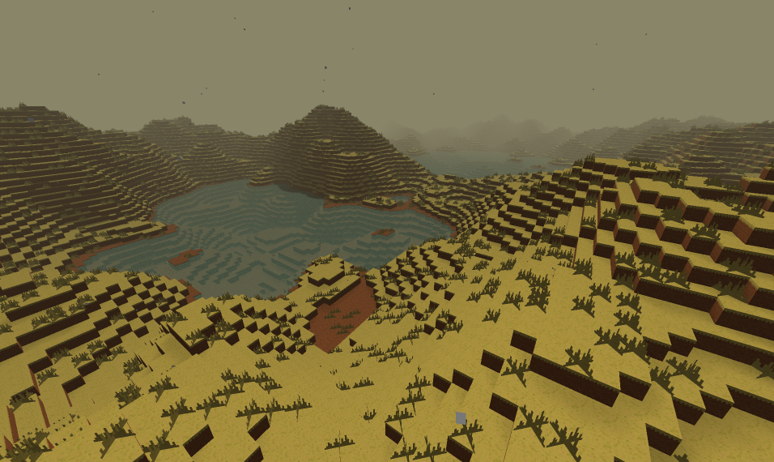

Game Demos for Voxel Tools for Godot
===============================

This project contains several demos to show off the different features of [Voxel Tools for Godot](https://github.com/Zylann/godot_voxel).

Voxel Tools is a C++ module for the [Godot game engine](https://godotengine.org). Godot must be built from source with Voxel Tools compiled into it. An instruction guide is provided in the VT repository docs.

VT is still a work in progress and is not yet feature complete. These scenes are just demos to learn from. Most voxel related issues should be reported to the VT repository above.

Screenshots
---------------

Available Demos
==================

Each demo is in a separate directory under the following names. Double click a scene, then press F6 to run it.

### fps_demo ###

Contributed by [Cory Petkovsek](https://github.com/tinmanjuggernaut/).

This demo has several example scenes. All have the following controls:

*Controls*
* W/A/S/D/Space - Move player, Jump
* Mouse wheel - Zoom between follow camera and first person
* Left mouse button - Shoot a bullet that adds terrain
* Right mouse button - Shoot a bullet that destroys terrain
* CTRL+mouse button - Shoot a bouncy ball that grows

*Demos*
1. **heightmap_smooth.tscn** - VoxelTerrain using the smooth Dual Marching Cubes (DMC) mesher, and a heightmap image as the data source.
1. **heightmap_blocky.tscn** - VoxelTerrain using the blocky mesher and a heightmap image as the data source. Textured with vertex-color.
1. **heightmap_smooth_lod.tscn** - VoxelLODTerrain using a heightmap image. Supports Levels Of Detail(LOD). Terrain is not yet editable.
1. **noise_smooth_lod.tscn** - VoxelLODTerrain using the smooth DMC mesher and OpenSimplexNoise as the data source. Supports Levels Of Detail(LOD). Terrain is not yet editable. Press 'N' to generate a new random terrain.
1. **custom_stream.tscn** - Generates a VoxelTerrain from code, and provides a data source from code. Read through CodeTerrain.gd to see what options you can turn on and off to try out the different types of terrains.

*Notes*
* The Player object exports a `Jump_is_jetpack` option in the Inspector to toggle jump/jetpack mode. It also exports walk and jump speeds.

* The camera does a pretty good job of detecting collisions and moving in closer to the player when you're inside a cave. Then it automatically pulls back after the camera_pullback_delay exported by the player. Use the wheel to override and keep the zoom in tighter.

* For older systems, you can increase performance with the following tips:
  * Use grass-rock.material instead of grass-rock2.material (which has extra texture lookups and is significantly slower)
  * Decrease shadow length to say 20 or 0. (World Environment scene, Directional Light)
  * Also, you generally want to keep vsync off and multithreaded off, which both currently slow down updates to the terrain.

* Materials
  * vertex-color.material - Plain white shader with `vertex_color_use_as_albedo` enabled. Use it on a blocky terrain to see the built in ambient occlusion.
  * grass-rock and grass-rock2.material - These are shaders that allow for separate top and sides/bottom textures, each having triplanar mapped albedo, normal and AO maps. V2 also detiles the textures so when viewed from a distance you don't see the repeating pattern of a tiled texture. It is however a little more expensive.
  * uv_checker.material - A numbered texture map for evaluating UVs.

### blocky_terrain ###
* main.tscn - VoxelTerrain with the blocky mesher, using a heightmap image for the source data. 
  * W/A/S/D/Space/Clicks/Wheel
  * 1 - Shadows on/off
  * 2 - Vsync on/off
  * F3 - Show map of built chunks

### dmc_terrain ###
* main.tscn - VoxelTerrain with the smooth mesher, using a heightmap image for the source data. 
* main_lod.tscn - VoxelLODTerrain with 3D noise for the source data.
  * W/A/S/D/Space/Clicks/Wheel (same for both)

### dmc_test ###
* main.tscn - A basic demo of moving a voxel cube around, using the smooth DMC mesher.
  * W/A/S/D/Space/Clicks/Wheel
  * Arrows/page up/page down move the voxel cube
  * Keypad +/- to adjust size
  * Keypad 3/4 to rotate
 
 

Archived Demos
-----------------

### GDScript Only Implementation ###
* The old, unmaintained, GDScript-only version of Voxel Tools can be found in the `full_gdscript` branch.

### transvoxel_test ###
* transvoxel_test.tscn - An initial test demo for a mesher that uses the transvoxel isometric algorithm. The mesher is not complete in VT and this demo is broken. Don't use.
